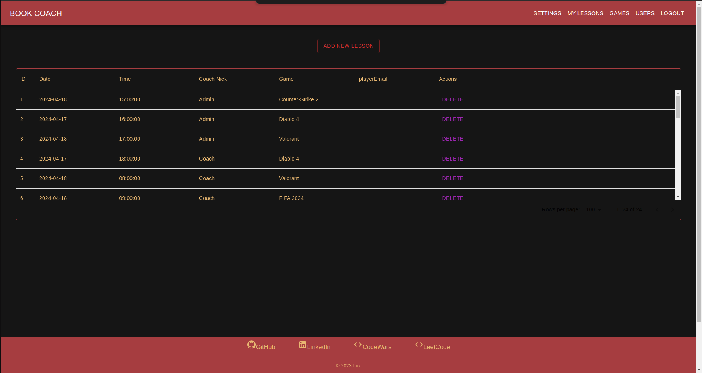

# # General info

This project provides a functional app for video game players and coaches to arrange training.  
BE:  [Book Coach BE](https://github.com/Luzu4/bookCoach_BE)
BE:  [Docker Image BE](https://hub.docker.com/repository/docker/luzu4/bookcoachbe/general)
FE:  [Docker Image FE](https://hub.docker.com/repository/docker/luzu4/bookcoachfe)

## Purpose
App was build as a final project for Java Coders Lab course.

## Technologies
- TypeScript
- React
- Material UI

## Main functionalities
Not authorized users are capable of accessing main page, logging, registration, searching coaches, registration lesson. Authentication is managed by Spring Security.

After creating an account, activation link is send from email provided in application.properties to an email address provided during registration. Before accessing this link account is considered as not-activated.

Users are basically divided into 3 roles: PLAYER, ADMIN and COACH. 
Program delivers various functionalities, depending on user role: 

NOT AUTHORIZED:
- account registration 
- logging
- registration lesson
- searching coaches by game

PLAYERS:
- viewing upcoming/past lessons
- unbook own lessons
- edit own data

COACH: 
- view upcoming/past lessons
- create/remove/unbook lessons
- cant remove past lessons

ADMIN: 
- assigning roles to users 
- assigning games to coaches
- removing and editing all lessons 
- adding new games
- editing games data

## Getting started
Program was designed to work with relational databases like MySQL. 
App need some additional configuration data to work properly. As indicated in application.properties
>spring.config.import=.env[.properties]

spring configuration information need to be included in the file .env in a format as below:

>SECRET_KEY = \
MYSQLDB_USER = \
MYSQLDB_PASSWORD = \
MYSQL_URL = \
MAIL_HOST = \
MAIL_PORT = \
MAIL_USERNAME = \
MAIL_PASSWORD = \

## Screenshots
- main page 
  
 
 
 

- loggin page
 

- registraion page
 

- user settings
 

- my lessons page (for coach)

- my lessons page (for player)

- creating lessons

- games page(only of admin)

- add new game (only for admin)

- edit game (only for admin)

- users list (only for admin)

- assign role and games for user (only for admin)

- book lesson 

- list of coaches by game

